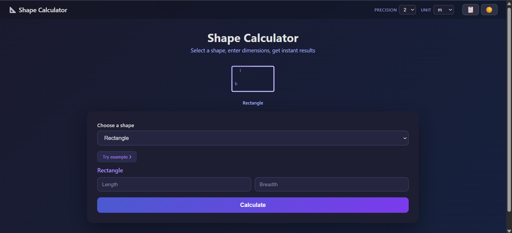

# 📐 Geometry Calculator

A web-based Geometry Calculator built using Python and Flask that calculates area, perimeter, surface area, and volume for multiple 2D and 3D shapes.

---

## ✨ Features

### 📏 2D Shapes
- Rectangle
- Square
- Circle
- Triangle
- Equilateral Triangle

### 📦 3D Shapes
- Cube
- Cuboid
- Cone
- Cylinder
- Prism
- Square Pyramid
- Triangular Pyramid

---

## ⚡ Calculations Included

### 2D Calculations
- Area
- Perimeter
- Circumference

### 3D Calculations
- LSA (Lateral Surface Area)
- TSA (Total Surface Area)
- Volume

---

## 🛠 Tech Stack

- Python
- Flask
- HTML5
- CSS3
- JavaScript

---

## 📂 Project Structure

```txt
shape_calculator_flask/
│
├── static/
│   ├── style.css
│   └── images/
|       └── preview.png
│
├── templates/
│   └── index.html
│
├── app.py
```

---

## 🚀 Installation

### 1. Clone Repository

```bash
git clone https://github.com/neon-glitch-ESC/Area-and-Volume-calculator.git
```

### 2. Open Project Folder

```bash
cd geometry-calculator
```

### 3. Install Dependencies

```bash
pip install flask
```

### 4. Run Application

```bash
python app.py
```

---

## 🌐 Open In Browser

```txt
http://127.0.0.1:5000
```

---

## 🧠 How It Works

- User selects a shape
- Inputs required dimensions
- Flask processes calculations
- Results are displayed instantly
- AJAX endpoint prevents page reloads

---

## 🔥 Key Features

- Dynamic calculations
- Clean Flask backend
- AJAX API support
- Responsive UI
- Formula display
- Error handling for invalid inputs

---

## 📡 API Endpoint

### POST `/calculate`

Returns JSON response with calculated values.

Example Response:

```json
{
  "type": "2d",
  "rows": [
    ["Area", 25, "sq units"],
    ["Perimeter", 20, "units"]
  ]
}
```

---

## 📸 Preview




---

## 🔮 Future Improvements

- Dark mode
- Unit conversion
- Graph visualization
- Shape diagrams
- Scientific calculator mode
- Calculation history
- Export results as PDF

---

## 👨‍💻 Author

GitHub: https://github.com/neon-glitch-ESC  
Instagram: https://instagram.com/0zoz_zoz0

---

⭐ Star this repository if you found it useful.
